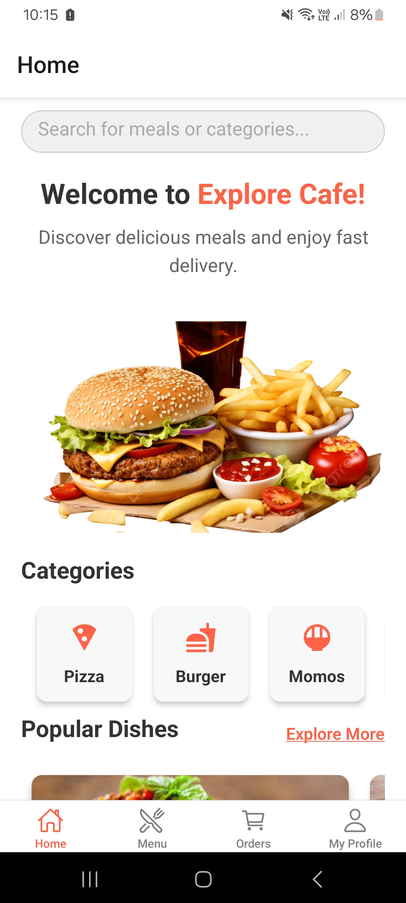
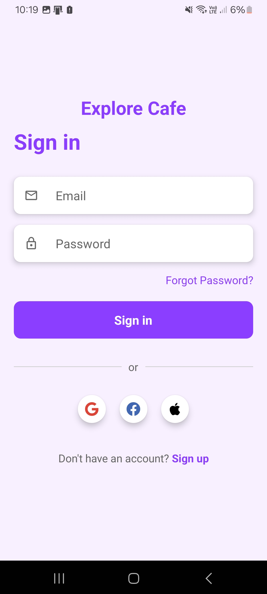
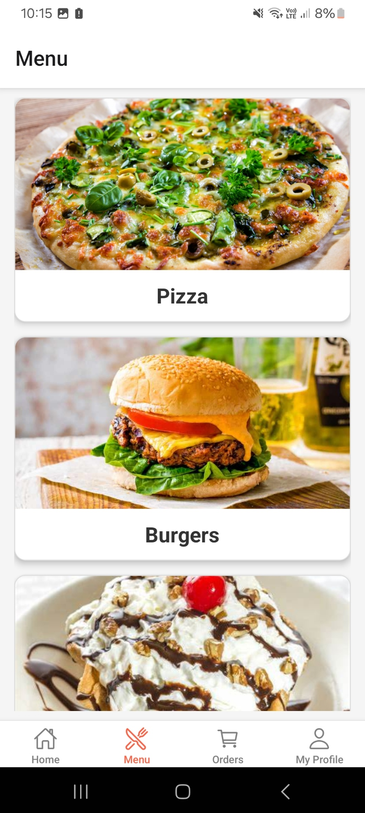
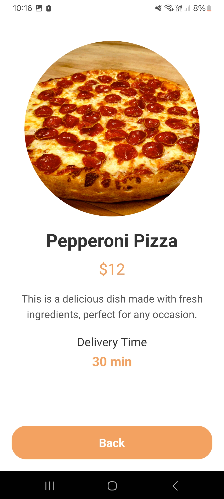
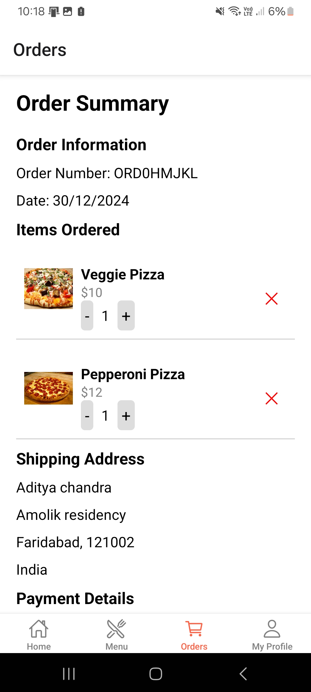

# Explore Cafe Food App 🍔

Welcome to **Explore Cafe**, a modern and user-friendly food delivery application built with **React Native** and **Supabase** for authentication. This app is designed to provide a seamless food ordering experience with secure user management. Whether you're craving a quick snack or a full meal, **Explore Cafe** has got you covered with easy access to menus, orders, and more!

---

## Features 🎉

- **User Authentication**:  
  Powered by Supabase, the app supports:
  - **Email and Password Login**: Secure login for users via email and password.
  - **Social Media Authentication**: Log in using popular social media accounts like Google, Facebook, or Twitter.

- **Menu Browsing**:  
  Explore a wide variety of dishes, categorized for easy navigation. Find everything from appetizers to desserts, and place your orders with just a few taps.

- **Cart Management**:  
  Add your favorite items to the cart, adjust quantities, and proceed to checkout with ease. The cart also keeps track of your order's total price.

- **Order Tracking**:  
  Track your orders in real-time. Receive updates on your order’s status, from preparation to delivery, directly in the app.

- **Responsive Design**:  
  The app is fully optimized for both **Android** and **iOS** devices, ensuring an excellent user experience on all platforms.

---

## Tech Stack 🛠️

### Frontend:
- **React Native**: A powerful cross-platform app development framework for building native apps for both Android and iOS with a single codebase.
- **Expo**: Streamline development and testing with Expo for a faster workflow and easy setup for React Native apps.

### Backend:
- **Supabase**: An open-source alternative to Firebase, offering real-time databases, authentication, and file storage.

### Other Tools:
- **Axios**: A promise-based HTTP client for making API requests and handling responses.
- **React Navigation**: A flexible routing and navigation library for seamless transitions between app screens.
- **Styled Components**: For clean, modular styling in the app, making it easy to manage and customize.

---

## Setup Instructions 🚀

### 1. Clone the Repository
Clone the project to your local machine:
```bash
git clone https://github.com/your-username/y-food-app.git
cd y-food-app
```

### 2. Install Dependencies
Install all required dependencies:
```bash
npm install
```

### 3. Configure Supabase
- Go to the [Supabase website](https://supabase.com) and create a project.
- Get your **API URL** and **Anon Key** from the Supabase dashboard.
- Create a `.env` file in the project root and add the following:
```env
SUPABASE_URL=your-supabase-url
SUPABASE_ANON_KEY=your-anon-key
```

### 4. Run the Application
To start the app, use Expo to run the app on your device or emulator:
```bash
npm start
```

---

## Screenshots 📸

Here are some screenshots showcasing the app's main features:

### **Home Screen**  
  
Users can log in with email/password or social media accounts.

### **SignIn Page**  
  
Users can log in with email/password or social media accounts.

### **Menu Browsing**  
  
Browse through various dishes, categorized for easy access.

### **item Discription**  
  
Showcase the item details like what thing has been used.

### **Order Tracking**  
  
Track the status of your orders in real-time.

---

## Future Enhancements 🚀

- **Payment Gateway Integration**:  
  Implement payment processing to handle credit card transactions securely within the app.

- **Push Notifications**:  
  Add real-time push notifications to alert users about order status updates, promotions, and more.

- **UI Animations**:  
  Enhance the user interface with animations to improve the overall experience.

- **Multilingual Support**:  
  Allow users to choose their preferred language for a more personalized experience.

---

## Contributing 🤝

Contributions are welcome!  
1. Fork the repository.  
2. Create a new branch (`git checkout -b feature-name`).  
3. Commit your changes (`git commit -m "Add feature name"`).  
4. Push to the branch (`git push origin feature-name`).  
5. Create a Pull Request.

---

## License 📜

This project is licensed under the **MIT License**. See the [LICENSE](LICENSE) file for more details.

---

## Contact 📬

Feel free to reach out for any queries or suggestions:  
**Email**: adityachandra419@gmail.com  
**GitHub**: [adityachandra512](https://github.com/adityachandra512)  

---

### Note:
Make sure to add actual screenshots in the `assets` folder and update the links accordingly. This enhances the documentation and gives users a better visual understanding of the app's features.
